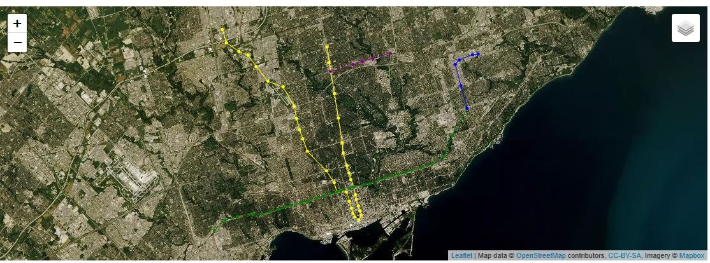
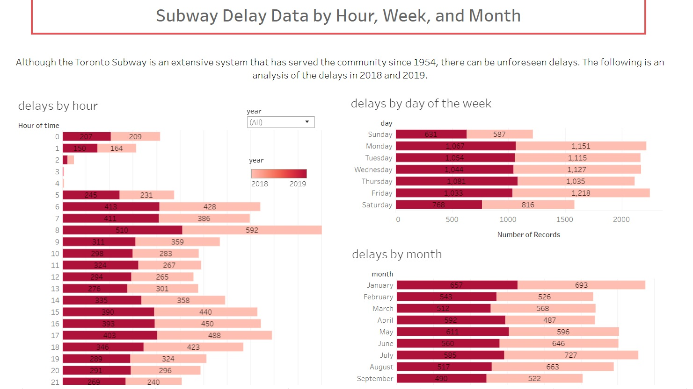
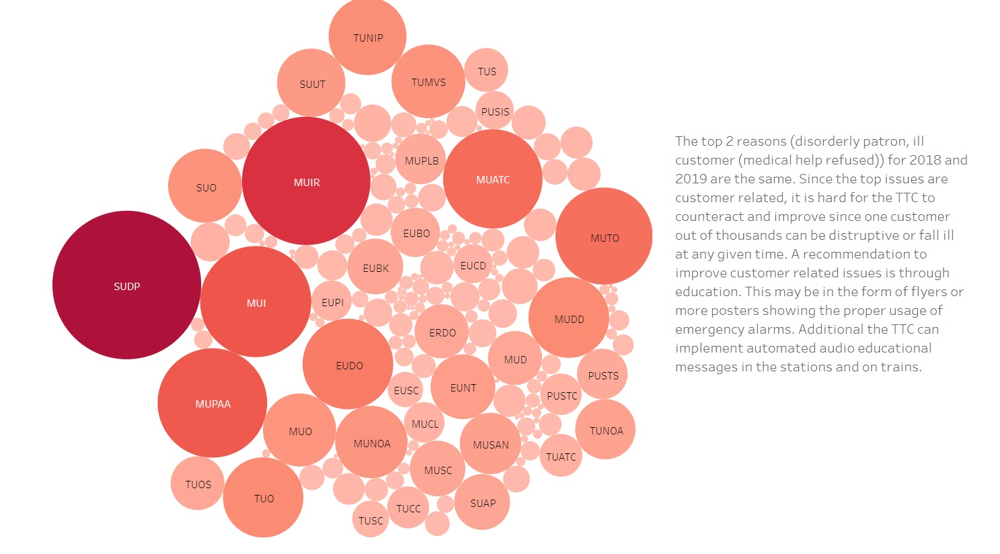
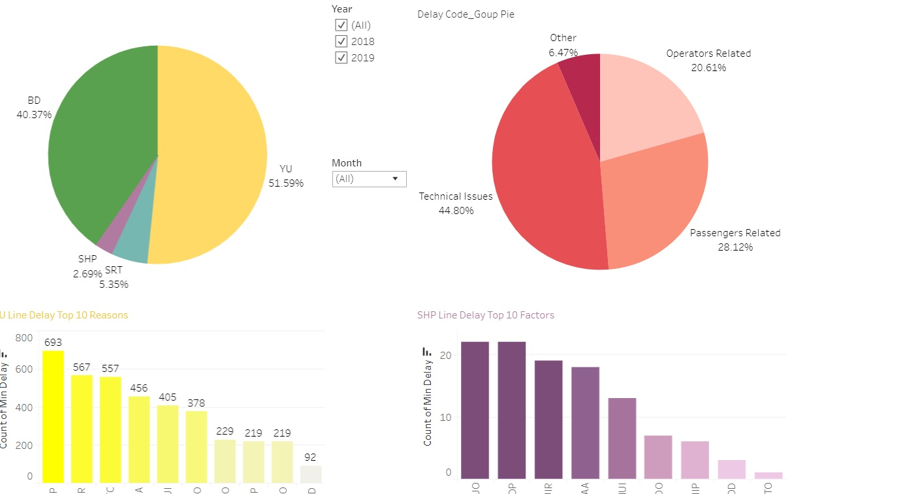
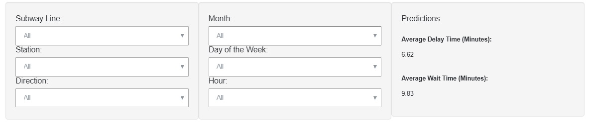

# Toronto Transit Commission (TTC) Subway Delays

## **Team Members:**
- Nadia Iskandar
- Ivy Fong
- Shaohua Liu
- Jennifer Huynh

**Toronto Transit Commission (TTC) Subway Delays**

In this project, we used the TTC subway delay dataset of 2018 and 2019. We created an interactive dashboard to display Map of Toronto and TTC subway stations, Key facts about the TTC and Analysis of subway delays by hour, day of the week, month and the delays by reason

**Tools and Installation**

The code was developed using 
-the Anaconda distribution of Python, versions 3. 7. Python libraries used are numpy, pandas, sklearn, matplotlib, Flask, SQLAlchemy
-Data upload to ASW and connect with PostgreSQL version 11.
-HTML/CSS
-JavaScript - Leaflet, D3
-Tableau desktop 2020.1 
-Heroku

**Data Sources**

City of Toronto Open Data - TTC monthly subway delay data: https://open.toronto.ca/dataset/ttc-subway-delay-data/
Wikipedia (multiple web pages) - TTC subway station coordinates (e.g. Bloor-Yonge station: https://en.wikipedia.org/wiki/Bloor%E2%80%93Yonge_station)
TTC Operating Statistics: https://www.ttc.ca/About_the_TTC/Operating_Statistics/2018/index.jsp

**Results**

Dashboard Link:https://ttc-subway-delay-dashboard.herokuapp.com/

1. **Leaflet Map(Map of Toronto and TTC subway stations)**
Popups (on hover) displaying the name of the subway station, total number of delays in 2019, average delay time in 2019, total number of delays in 2018, and average delay time in 2018

2. **Tableau Dashboard**

Analysis of subway delays by hour, day of the week, and month

Analysis of subway delays by reason

3.**Predictions**

Dropdown filters: Subway line, station, direction, month, day of the week, and hour
Average delay time
Average wait time

**Authors**

Nadia Iskandar ; 
Ivy Fong;
Shaohua Liu;
Jennifer Huynh;

**Acknowledgments**

•	Hat tip to anyone whose code was used

•	Ahmad G. Sara H. Snedden M.

